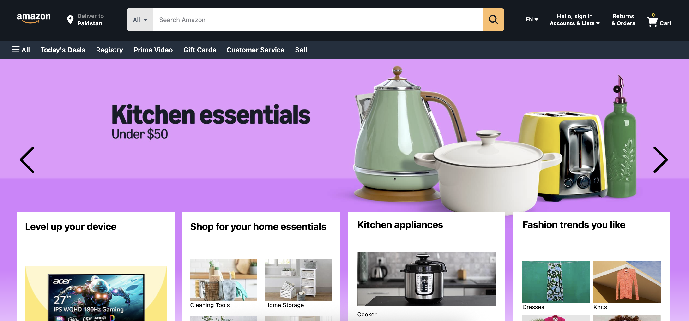
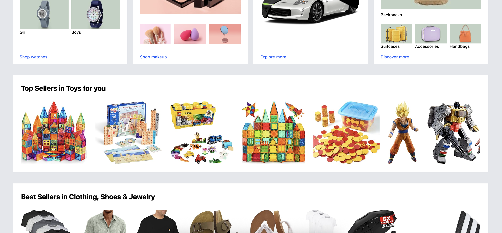
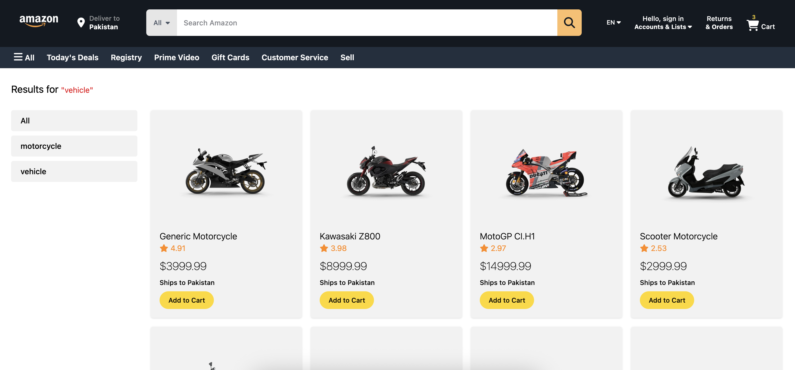
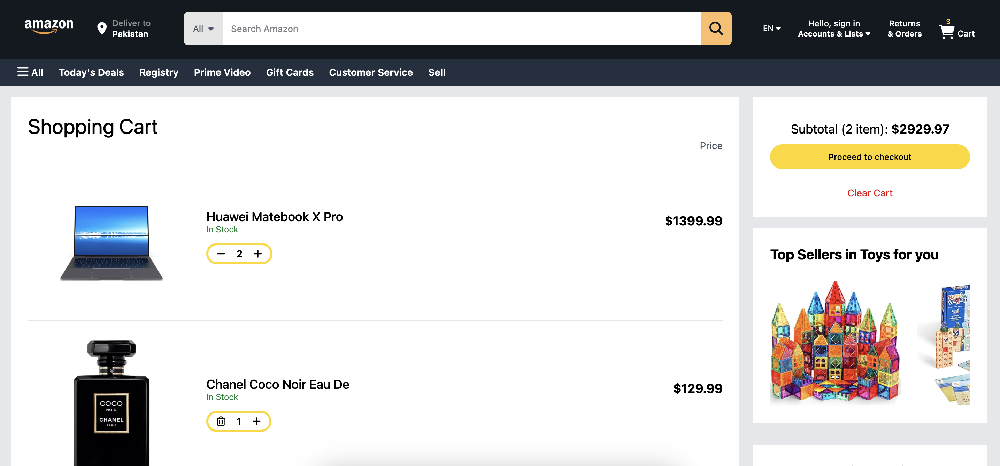
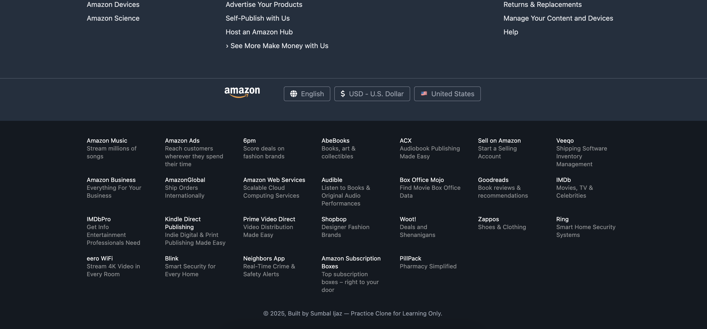

# Amazon Clone – React E-commerce Website

This is a fully responsive Amazon-like e-commerce web app built with **React**, **Redux**, and **Tailwind CSS**. Products are dynamically fetched and displayed using a **dummy products API**, with category-based filtering and a functional shopping cart.

## 🚀 Live Demo

👉 [\[Add your live site link here\]](https://fir-16fc3.web.app)

---

## Tech Stack

- **React** – Frontend library
- **Redux Toolkit** – State management (Cart, Products)
- **Tailwind CSS** – For responsive and utility-first styling
- **Jest** – Unit testing for components
- **Dummy JSON API** – For product data

---

## ✨ Features

- Add to cart
- Quantity control (increment/decrement/remove)
- Category-based filtering
- Responsive design
- Unit testing with Jest
- Cart persistence using localStorage

---

##  Getting Started

Clone the repo:

```bash
git clone https://github.com/summbal122/Amazon.git
cd Amazon
```
## 📸 Screenshots

### Home Page




### Product Listing Page



### Cart Page


### Footer



